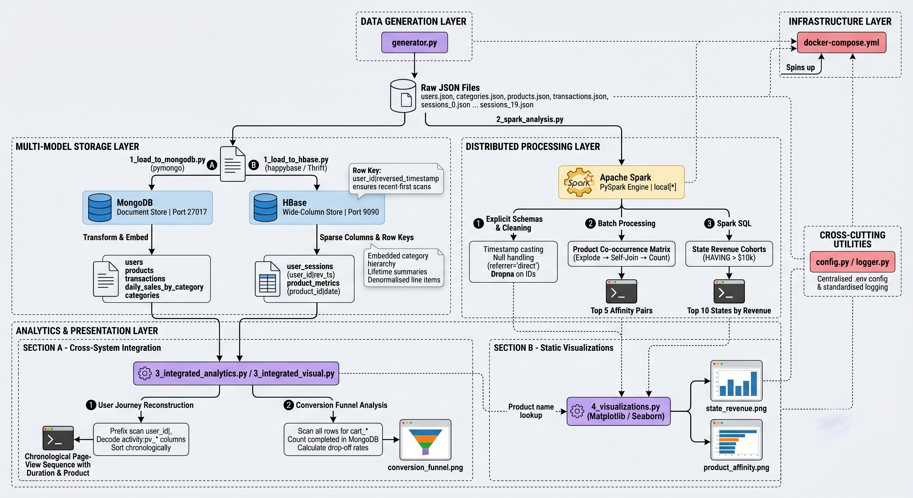

# Distributed Multi-Model Analytics for E-Commerce Data

Final project for the AUCA Big Data Analytics course. An end-to-end analytics
pipeline over a synthetic e-commerce dataset using **MongoDB** (document store),
**HBase** (wide-column store), and **Apache Spark** (distributed processing).

---

## System Architecture


*Data generation → ingestion into MongoDB/HBase → Spark processing → visualisation*

| Stage | Script | What it does |
|---|---|---|
| Generation | `generator.py` | Writes JSON for users, categories, products, transactions, and sessions (20 chunks) |
| Ingestion | `1_load_to_mongodb.py` | Loads entities with embedded category hierarchies, lifetime summaries, and a materialised view |
| Ingestion | `1_load_to_hbase.py` | Creates `user_sessions` and `product_metrics`; loads sessions as sparse activity columns |
| Processing | `2_spark_analysis.py` | Cleans data, builds a product co-occurrence matrix with a random baseline, runs Spark SQL; writes `results/*.csv` |
| Integration | `3_integrated_visual.py` | Cross-store conversion funnel (HBase carts + MongoDB purchases) |
| Integration | `3_integrated_analytics.py` | Reconstructs one user's click path to purchase across both stores |
| Presentation | `4_visualizations.py` | Four static charts from `results/` and MongoDB |

---

## Table of Contents

- [Prerequisites](#prerequisites)
- [Setup](#setup)
- [Execution](#execution)
- [Outputs](#outputs)
- [Findings and Analytical Validity](#findings-and-analytical-validity)
- [Verification Queries](#verification-queries)
- [Troubleshooting](#troubleshooting)
- [Environment Variables](#environment-variables)

---

## Prerequisites

- **Docker** and **Docker Compose** (>= 2.0)
- **Python 3.10+** with `pip`
- **8 GB RAM** minimum (Spark and HBase are both memory-hungry)
- **~2 GB** free disk for the generated dataset

---

## Setup

```bash
git clone https://github.com/Elthiero/auca-big-data-analytics-final-exam.git
cd auca-big-data-analytics-final-exam

python -m venv venv
source venv/bin/activate          # Windows: venv\Scripts\activate

pip install -r requirements.txt
cp .env.example .env              # defaults work for the local Docker setup
```

---

## Execution

Run everything from the repository root, in this order. **Steps 5 and 6 depend
on `results/`, which step 4 creates**, so do not reorder them.

Measured runtimes are from a full run on a laptop (see
[screenshots/](screenshots/)); yours will vary.

### 1. Start the containers

```bash
docker-compose up -d
docker-compose ps                 # both services must show "Up"
```

HBase needs 30-60 seconds to bring up its Thrift server. Confirm with:

```bash
docker-compose logs -f hbase      # wait for "ThriftServer started"
```

### 2. Generate the dataset — *~5-10 min*

```bash
python generator.py
```

Produces in `data/`: 10,000 users, 25 categories, 5,000 products,
500,000 transactions, and 2,000,000 sessions split across
`sessions_0.json` … `sessions_19.json`. Progress logs every 50k iterations.

### 3. Load MongoDB — *~27 s*

```bash
python 1_load_to_mongodb.py
```

Embeds category hierarchies into products, computes `lifetime_summary` and
`segmentation_tags` per user, denormalises product and category names into
transaction line items, creates indexes, and builds the
`daily_sales_by_category` materialised view.

### 4. Load HBase — *~11 min*

```bash
python 1_load_to_hbase.py
```

Creates `user_sessions` (row key `user_id|reversed_timestamp`; families
`session`, `geo`, `device`, `activity`) and `product_metrics` (row key
`product_id|YYYYMMDD`). Expect a final `Total sessions loaded: 2000000`.

> The bulk of this time is Thrift round-trips, not HBase itself. Loading via
> the native Java API or an HFile bulk load would be substantially faster.

### 5. Spark analytics — *~1-3.5 min*

```bash
python 2_spark_analysis.py
```

Three tasks: cleaning with explicit schemas, a product co-occurrence matrix
with a random baseline, and a Spark SQL join for revenue by region.
Writes `results/product_affinity.csv`, `results/state_revenue.csv`, and
`results/affinity_baseline.csv`.

### 6. Integrated analytics

```bash
python 3_integrated_visual.py       # ~3 min — scans 2M HBase rows
python 3_integrated_analytics.py    # ~1 s
```

The first computes the cross-store funnel and saves `conversion_funnel.png`.
The second picks a completed transaction from MongoDB, locates its session via
a user-scoped HBase prefix scan, and prints the chronological click path.

### 7. Charts

```bash
python 4_visualizations.py
```

Reads `results/*.csv` and MongoDB. No values are hard-coded, so the charts
regenerate with the pipeline. Each chart skips with a warning if its upstream
source is missing rather than failing the run.

---

## Outputs

### Charts (`visualizations/`)

| File | Source | Shows |
|---|---|---|
| `conversion_funnel.png` | HBase + MongoDB | Sessions → carts → completed purchases |
| `state_revenue.png` | `results/state_revenue.csv` | Top 10 regions by revenue |
| `product_affinity.png` | `results/product_affinity.csv` | Top co-viewed pairs, annotated with the random baseline |
| `category_revenue_trend.png` | MongoDB materialised view | Daily revenue, top 5 categories, 7-day rolling mean |
| `user_segmentation.png` | MongoDB `users` | Users per segment and average lifetime spend |

### Data products (`results/`)

| File | Contents |
|---|---|
| `state_revenue.csv` | Top 10 regions: users, revenue, average order value |
| `product_affinity.csv` | Top 5 co-viewed product pairs with counts |
| `affinity_baseline.csv` | Distinct products, pair instances, candidate pairs, expected count per pair, observed max |

---

## Findings and Analytical Validity

Every headline result was checked against `generator.py` to determine whether
the underlying variable carries structure or is assigned at random. Three of
five do not survive that check, and are reported as negative results.

| Analysis | Mechanism | Business signal | Limiting factor |
|---|---|---|---|
| Conversion funnel | Valid | Partial | Numerator and denominator drawn from different populations |
| Regional revenue | Valid | **None** | Ranks user count, not demand |
| Product affinity | Valid | **Confounded** | Raw counts rank popularity; needs lift/PMI |
| Category revenue trend | Valid | **None** | `random.choice` on categories |
| Customer segmentation | Valid | Present | Thresholds are fixed rather than quantile-based |

**Funnel** — 2,000,000 sessions; 1,298,408 (64.92%) reached a cart;
317,055 completed purchases; 15.85% overall conversion. The purchase count
includes transactions generated without a parent session
(`session_id = null`), which have no cart event in HBase, so 24.42% is an
upper bound on the true cart-to-purchase rate, not a measurement of it.

**Regional revenue** — revenue spread across the top 10 is 19.1%, user-count
spread is 18.9%, and revenue *per user* varies by only 6.1% ($25,913-$27,497).
Revenue tracks user count almost exactly, and state is assigned by
`fake.state_abbr()`. The ranking is a user-count ranking; 10,000 users over
~56 regions gives ~179 expected each, and New York's 214 is the expected
maximum of 56 draws. No targeting decision follows from this chart.

**Product affinity** — expected count per pair is 0.9673; the observed maximum
is 14, with five pairs tied. That is *not* explicable as chance: a homogeneous
Poisson model predicts a maximum near 10. But it is not affinity either. The
generator draws each product view independently, so no co-view structure
exists; the excess comes from unequal product popularity created by the
`is_active and current_stock > 0` rejection loop in `get_page_content()`
combined with inventory depletion. Popular pairs get high *raw* counts while
their lift stays near 1. Raw co-occurrence measures popularity, not
relatedness — which is exactly what lift and PMI are designed to correct.

---

## Verification Queries

MongoDB (`docker exec -it auca_mongodb mongosh ecommerce_analytics`):

```javascript
db.users.countDocuments()          // 10000
db.transactions.countDocuments()   // 500000
db.products.findOne()              // embedded category.subcategory
db.users.findOne({ segmentation_tags: "high_value" })
db.transactions.find({ user_id: "user_000042" }).explain("executionStats")
```

HBase (`docker exec -it auca_hbase hbase shell`):

```
list
scan 'user_sessions', {LIMIT => 1}
scan 'user_sessions', {ROWPREFIXFILTER => 'user_000042|', LIMIT => 5}
scan 'user_sessions', {ROWPREFIXFILTER => 'user_000042|', COLUMNS => ['device']}
scan 'product_metrics', {ROWPREFIXFILTER => 'prod_00123|'}
```

> **Never run a bare `scan 'user_sessions'`** — it will attempt to return 2M
> rows. Always constrain with `LIMIT` or `ROWPREFIXFILTER`.

---

## Troubleshooting

| Issue | Cause | Fix |
|---|---|---|
| `TTransportException` / `TSocket read 0 bytes` | Thrift server not ready | `docker-compose logs hbase`, wait for `ThriftServer started`, re-run |
| `ServerSelectionTimeoutError` | MongoDB not running or port 27017 taken | `docker-compose ps` |
| `4_visualizations.py` logs "Skipping ... missing results/..." | Step 5 not run | Run `2_spark_analysis.py` first |
| Charts 3-4 skipped with "MongoDB unavailable" | Container down or DB not loaded | Start containers, run `1_load_to_mongodb.py` |
| `OutOfMemoryError` in Spark | Schema inference on large JSON | Scripts use explicit schemas; if it persists raise `spark.driver.memory` in `2_spark_analysis.py` |
| Spark job feels slow | `multiline=true` makes JSON non-splittable, so each file is one task | Known limitation; JSON Lines output from the generator would allow partitioning |
| `generator.py` is slow | 2M sessions is CPU-bound | Normal; progress logs every 50k |
| Scripts cannot find `data/` | Generator not run, or wrong working directory | Run from the repository root after `generator.py` |

---

## Environment Variables

`.env` overrides the defaults in `config.py`:

| Variable | Default | Description |
|---|---|---|
| `LOG_LEVEL` | `INFO` | `DEBUG`, `INFO`, `WARNING`, `ERROR` |
| `MONGO_URI` | `mongodb://localhost:27017/` | MongoDB connection string |
| `MONGO_DB_NAME` | `ecommerce_analytics` | Database used by all scripts |
| `HBASE_HOST` | `localhost` | Thrift host |
| `HBASE_PORT` | `9090` | Thrift port |
| `SPARK_APP_NAME` | `ECommerceAnalytics` | Name shown in the Spark UI |
| `SPARK_MASTER` | `local[*]` | Master URL |

---

## Repository Structure

```text
.
├── docker-compose.yml          # MongoDB & HBase containers
├── config.py                   # Centralised configuration
├── logger.py                   # Standardised logging
├── generator.py                # Synthetic dataset generator
├── 1_load_to_mongodb.py        # MongoDB ingestion + aggregation pipelines
├── 1_load_to_hbase.py          # HBase schema creation & session loading
├── 2_spark_analysis.py         # PySpark cleaning, affinity matrix, Spark SQL
├── 3_integrated_visual.py      # Cross-store conversion funnel
├── 3_integrated_analytics.py   # Cross-store user-journey reconstruction
├── 4_visualizations.py         # Static chart generation
├── requirements.txt
├── .env.example
├── data/                       # Generated JSON (gitignored)
├── results/                    # Spark CSV outputs
├── visualizations/             # Output charts
├── screenshots/                # Execution evidence
└── report/final_exam.pdf       # Technical report
```

---

## License

Developed for educational purposes as part of the AUCA Big Data Analytics
course. Provided as is.